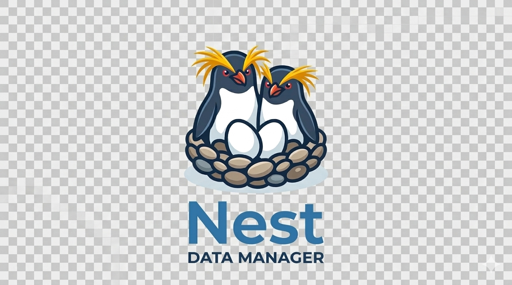

<p align="center">
  
</p>

[](https://github.com/penguintechinc/nest/actions/workflows/ci.yml)
[](https://github.com/penguintechinc/nest/actions/workflows/docker-build.yml)
[](https://goreportcard.com/report/github.com/penguintechinc/nest)
[](LICENSE.md)

# Nest — Data Infrastructure Platform for Kubernetes and Public Cloud

Nest is a multi-tenant data infrastructure platform that manages data infrastructure on Kubernetes and in public clouds. It provisions and lifecycle-manages storage, databases, search, streaming, and analytics backends through three origination modes: Kubernetes-native (`DataResource` CRs with Rook-Ceph), managed cloud resources (AWS, Azure, GCP), and adopted external resources, on behalf of isolated tenants.

**Module:** `github.com/penguintechinc/nest`
**API base:** `/api/v1`

## What Nest Manages

Block volumes, shared filesystems, S3-compatible object buckets, PostgreSQL clusters, Valkey/Redis, Kafka, OpenSearch (dedicated and shared multi-tenant), ClickHouse, Trino, Iceberg, vector databases, NFS, iSCSI — and cloud-native equivalents (EBS, GCS, Azure Blob, etc.).

All resources are provisioned through a single `DataResource` CR and managed by the Nest k8s-controller. Rook-Ceph provides the on-cluster storage backend. Cloud-native block and object storage (AWS EBS/S3, Azure Disk/Blob, GCP PD/GCS) is available via 3rd-party management mode.

## Management Modes

Nest operates in three modes, selectable per `DataResource` via `spec.origination`:

**1st Party — Managed** (`origination: managed`, default)
Nest provisions and fully lifecycle-manages the resource on-cluster using Rook-Ceph (block, file, object), CNPG (PostgreSQL), OpenSearch, Valkey, and other operators. Full feature support: data protection, PITR, DarkDrive-aware scheduling, CSI, Eggs, anomaly detection.

**3rd Party — Cloud-Native** (`origination: external`)
Nest provisions and manages cloud-provider resources via their native APIs — AWS EBS/S3, Azure Managed Disk/Blob, GCP Persistent Disk/GCS. DataResource lifecycle (create/delete/status), tenant isolation, quota, and audit are fully supported. Some features are unavailable or provider-dependent. See [docs/spec/provider-support.md](docs/spec/provider-support.md) for the feature matrix.

**Imported** (`origination: imported`)
Nest adopts an existing engine it does not own — an Amazon RDS or Aurora instance, a Cloud SQL database, or a self-hosted/on-prem server — and monitors it without provisioning it. Adoption works against any reachable endpoint via `spec.import.connectionString`, and is strictly read-only: Nest never provisions, mutates, or deletes an adopted resource, and deleting the `DataResource` releases Nest's reference while the engine keeps running. Setting `spec.external` alongside adds best-effort provider metadata and health for the clouds listed in [docs/spec/provider-support.md](docs/spec/provider-support.md).

## Quick Start

```bash
# Deploy Nest
kubectl kustomize k8s/kustomize/overlays/alpha | kubectl apply -f -

# Provision a block volume
kubectl apply -f - <<EOF
apiVersion: nest.penguintech.io/v1
kind: DataResource
metadata:
  name: my-volume
  namespace: default
spec:
  type: pvc/block
  tenant: acme
  size:
    storage: 20Gi
EOF

kubectl wait --for=condition=Ready dataresource/my-volume --timeout=120s
```

## Documentation

| Document                                                                                   | Description                                                                                            |
| ------------------------------------------------------------------------------------------ | ------------------------------------------------------------------------------------------------------ |
| [docs/USAGE.md](docs/USAGE.md)                                                             | Full user guide — all DataResource types, data protection, eggs, tenant isolation, API reference       |
| [docs/spec/storage-types.md](docs/spec/storage-types.md)                                   | Exhaustive type reference with YAML examples for every supported backend                               |
| [docs/spec/provider-support.md](docs/spec/provider-support.md)                             | Cloud provider support matrix — provisioning, feature coverage, and limitations by cloud/resource type |
| [docs/WORKFLOWS.md](docs/WORKFLOWS.md)                                                     | Lifecycle workflows — provisioning, protection, migration, restore, onboarding                         |
| [docs/CONTRIBUTING.md](docs/CONTRIBUTING.md)                                               | Development setup, adding new types, PR process                                                        |
| [docs/migration/longhorn-to-nest.md](docs/migration/longhorn-to-nest.md)                   | Migration guide from Longhorn                                                                          |
| [docs/ops/migrate-from-longhorn.md](docs/ops/migrate-from-longhorn.md)                     | Ops runbook for Longhorn migration                                                                     |
| [docs/ops/object-storage-lifecycle.md](docs/ops/object-storage-lifecycle.md)               | Object storage operations                                                                              |
| [docs/infrastructure/ceph-architecture.md](docs/infrastructure/ceph-architecture.md)       | Rook-Ceph integration architecture                                                                     |
| [docs/infrastructure/ceph-deployment.md](docs/infrastructure/ceph-deployment.md)           | Ceph + Nest deployment guide                                                                           |
| [docs/infrastructure/ceph-troubleshooting.md](docs/infrastructure/ceph-troubleshooting.md) | Troubleshooting Ceph, CSI, and storage issues                                                          |

## Architecture

```
                    ┌─────────────────────────────────┐
                    │         Kubernetes API           │
                    └───────────────┬─────────────────┘
                                    │ DataResource CRs
                    ┌───────────────▼─────────────────┐
                    │        k8s-controller            │
                    │  (reconciles all DataResource    │
                    │   types + DataProtectionPolicy)  │
                    └──┬───────┬───────┬───────┬──────┘
                       │       │       │       │
              ┌────────▼─┐ ┌───▼──┐ ┌──▼───┐ ┌▼────────┐
              │ Rook-Ceph│ │ CNPG │ │Valkey│ │OpenSearch│
              │(RBD/CephFS│ │ (PG) │ │/Redis│ │Operator │
              │   /RGW)  │ └──────┘ └──────┘ └─────────┘
              └──────────┘

  node-agent (DaemonSet) → discovers DarkDrives → HardwareInventory CRs
  CSI driver             → thin shim proxying to Rook-Ceph sockets
  injector               → MutatingWebhook rewrites nest-block → rook-ceph-block
  scheduler              → places DataResources on pools with DarkDrives preferred
  nest-api (Python/Quart)→ REST API for tenant operations
  admin-ui (React)       → web dashboard
```

## License

See [docs/LICENSE.md](docs/LICENSE.md).
